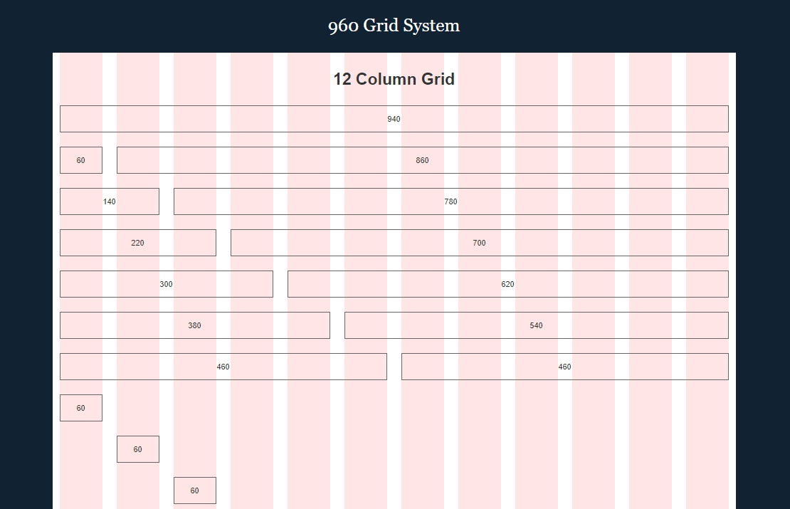

# Работа с модульной сеткой

Модульная сетка представляет из себя набор направляющих линий, согласно которым строится композиция сайта и располагаются элементы.

Пример ([960 Grid System](https://960.gs/demo.html)):



Модульная сетка состоит из колонок и межколонников (расстояния между колонками).

Количество колонок может варьироваться.
Наиболее распространена 12 колоночная сетка, ввиду большого количества делителей (1, 2, 3, 4, 6, 12), позволяющих сделать сетку из соответствующего числа колонок.

## Модульная сетка в Foundation

[Foundation](12_foundation.md) предоставляет средства для создания и работы с модульными сетками.

В данном фреймворке имеется три основных способа создания сетки:

* [Float Grid](http://foundation.zurb.com/sites/docs/grid.html).
* [Flex Grid](http://foundation.zurb.com/sites/docs/flex-grid.html).
* [XY Grid](http://foundation.zurb.com/sites/docs/xy-grid.html).

### XY Grid

С выходом Foundation версии 6.4 [Float Grid](http://foundation.zurb.com/sites/docs/grid.html) и [Flex Grid](http://foundation.zurb.com/sites/docs/flex-grid.html) объявлены устаревшими, а на замену им пришла система [XY Grid](http://foundation.zurb.com/sites/docs/xy-grid.html).

### Подключение

XY Grid включена по умолчанию при подключении `foundation-everything`:

```scss
@include foundation-everything;
```

Также можно подключить сетку отдельно:

```scss
@include foundation-xy-grid-classes;
```

### Основы

В XY Grid изменились названия классов, обозначающих колонки и контейнеры:

* `.row` заменен на `.grid-x` (или `.grid-y` для вертикальных сеток).
* `.column` и `.columns`) заменены на `.cell`.

Пример:

```jade
.grid-x
    .cell
    .cell
.grid-x
    .cell.small-6
    .cell.small-6
.grid-x
    .cell.medium-6.large-4
    .cell.medium-6.large-8
```

### Межколоночные расстояния

Имеется два способа добавления расстояния между колонками:

* `.grid-margin-x` (`.grid-margin-y` для вертикальных сеток)
* `.grid-padding-x` (`.grid-padding-y` для вертикальных сеток)

```jade
.grid-x.grid-margin-x
    .cell.medium-6.large-4
    .cell.medium-6.large-8
.grid-x.grid-padding-x
    .cell.medium-6.large-4
    .cell.medium-6.large-8
```

### Контейнер

По умолчанию `.grid-x` растягивается на всю доступную ширину.
Чтобы избежать этого можно обернуть сетку в класс `.grid-container`.
Таким образом блок будет ограничен по ширине и выровнен по центру.

```jade
.grid-container
    .grid-x.grid-margin-x
        .cell.small-4
        .cell.small-4
        .cell.small-4
```

Добавление блоку `.grid-container` класса `.fluid` отключает ограничение по ширине.

```jade
.grid-container.fluid
    .grid-x.grid-margin-x
        .cell.small-4
        .cell.small-4
        .cell.small-4
```

При этом сохраняются боковые поля, убрать которые можно, заменив класс `.fluid` на `.full`.

> Возможно появление горизонтальной прокрутки.
> Для скрытия скроллбара следует воспользоваться следующим стилем:
> ```scss
> body {
>     overflow-x: hidden;
> }
> ```

```jade
.grid-container.full
    .grid-x.grid-margin-x
        .cell.small-4
        .cell.small-4
        .cell.small-4
```

### Автоматический размер колонок

Колонки с классом `.auto` (или `.[size]-auto`) занимают все оставшееся пространство.

```jade
.grid-x.grid-margin-x
    .cell.small-4
    .cell.auto
```

Несколько колонок с автоматическим размером делят пространство поровну.

```jade
.grid-x.grid-margin-x
    .cell.small-4
    .cell.auto
    .cell.auto
```

При добавлении класса `.shrink` (или `.[size]-shrink`) колонка займет столько места, сколько необходимо для ее содержимого.

```jade
.grid-x.grid-margin-x
    .cell.shrink
    .cell.auto
```

### Отключение межколоночного расстояния

Межколоночное расстояние можно убрать с помощью класса `.[size]-[gutter-type]-collaps`.

```jade
.grid-x.grid-margin-x.medium-margin-collapse
    .cell.small-6
    .cell.small-6
```

### Сдвиги

Для сдвига колонок следует применять класс `.[size]-offset-[n]`.

```jade
.grid-x.grid-margin-x
    .cell.small-4.large-offset-2
    .cell.small-4
```

### Многострочная сетка

Иногда требуется создать сетку с несколькими однотипными рядами колонок.

```jade
.grid-x.grid-margin-x
    .cell.small-6.medium-3.large-2
    .cell.small-6.medium-3.large-2
    .cell.small-6.medium-3.large-2
    .cell.small-6.medium-3.large-2
    .cell.small-6.medium-3.large-2
    .cell.small-6.medium-3.large-2
```

Вместо дублирования классов колонок следует задать контейнеру класс `.[size]-up-[n]`.

```jade
.grid-x.grid-margin-x.small-up-2.medium-up-4.large-up-6
    .cell
    .cell
    .cell
    .cell
    .cell
    .cell
```

### Порядок колонок

Изменять порядок колонок можно либо с помощью CSS-свойства `order`:

```scss
.cell:nth-child(2) {
    order: 1;
}

.cell:nth-child(1) {
    order: 2;
}
```

Либо с помощью класса `.[size]-order-[n]`:

```jade
.grid-x.grid-margin-x
    .cell.small-6.small-order-2.medium-order-1
    .cell.small-6.small-order-1.medium-order-2
```
